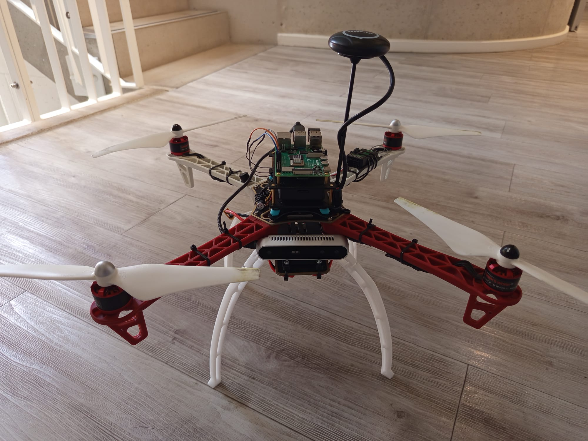
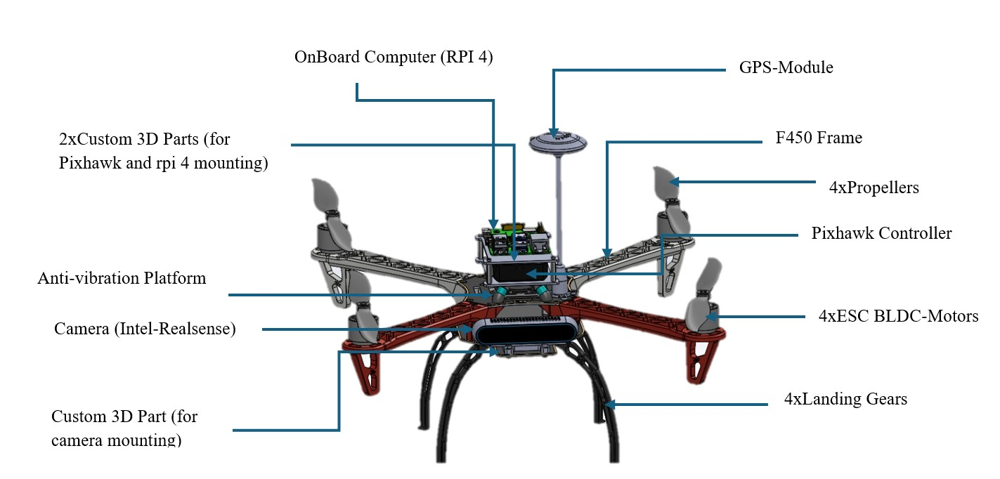

# Autonomous F450 Quadcopter Project

<div align="center">
  <br>
  <sub><b>F450 Quadcopter Platform</b></sub>
</div>

An advanced autonomous quadcopter system combining **control**, **computer vision**, and **custom hardware integration** for GPS-denied navigation. This project explores the complete development pipeline from mathematical modeling and simulation to real-world implementation.
## Project Overview

This project combines multiple robotics domains to create an autonomous quadcopter capable of navigation in GPS-denied environments:

- **Advanced Control**: Nonlinear Model Predictive Control (NMPC) and PID implementations
- **Computer Vision**: SLAM and object detection using Intel RealSense depth camera  
- **Hardware Integration**: Custom 3D-printed mounting solutions for Pixhawk + Raspberry Pi 4B and Intel RealSense Depth Camera
- **Software Architecture**: ROS-based modular system design
- **Full Pipeline**: From mathematical modeling through simulation to real-world testing

## Hardware Platform

**HAWK'S WORK F450 Drone Kit** with custom integration:
- **Flight Controller**: Pixhawk (ArduPilot/PX4)
- **Companion Computer**: Raspberry Pi 4B
- **Depth Camera**: Intel RealSense
- **Custom Components**: 3D-printed mounting plates for clean integration

<div align="center">
  <br>
  <sub><b>F450 Quadcopter Platform 3D Model</b></sub>
</div>

## Documentation

Comprehensive documentation available in the [project wiki](https://github.com/Desmondfotock28/Quadcopter/wiki):

- **[Hardware Setup](https://github.com/Desmondfotock28/Quadcopter/wiki/Hardware-Setup)** - Complete build guide with 3D printed components
- **[Control Theory](https://github.com/Desmondfotock28/Quadcopter/wiki/Control-Theory)** - Mathematical foundations and NMPC formulation  
- **[NMPC Implementation](https://github.com/Desmondfotock28/Quadcopter/wiki/NMPC-Implementation)** - Algorithm development and testing
- **[Computer Vision](https://github.com/Desmondfotock28/Quadcopter/wiki/Computer-Vision)** - SLAM and object detection roadmap
- **[ROS Integration](https://github.com/Desmondfotock28/Quadcopter/wiki/ROS-Integration)** - System architecture and communication
- **[3D Printing](https://github.com/Desmondfotock28/Quadcopter/wiki/3D-Printing)** - Custom mounting plate design and manufacturing
- **[Learning Journey](https://github.com/Desmondfotock28/Quadcopter/wiki/Learning-Journey)** - Skills development and project evolution

## Quick Start

### Repository Structure
```
├── algorithms/             # Algorithm development (not for RPi deployment)
│   └── nmpc/               # NMPC implementations and testing
│       └── active_subspace/    # Active subspace optimization methods
├── src/                    # ROS packages for deployment
│   └── drone_control/      # ROS2 control nodes with C++ implementation
├── hardware/               # CAD models and 3D designs
│   └── cad_models/         # STEP files for all drone components
├── assets/                 # Images and documentation media
│   ├── hardware/           # Photos of physical drone
│   └── models/             # 3D renderings and diagrams
└── *.sh                    # Helper scripts for MAVROS2 operations
```

### Running NMPC Simulations (Development)
```bash
# Single shooting NMPC
python algorithms/nmpc/single_shooting_nmpc.py

# Multiple shooting NMPC  
python algorithms/nmpc/multiple_shooting_nmpc.py

# Active subspace methods
python algorithms/nmpc/active_subspace/single_shooting_active_subspace.py
```

### Raspberry Pi Deployment (ROS2)

#### SSH into Raspberry Pi
```bash
# Connect to RPi
ssh [USERNAME]@[YOUR-IP]

# Or if using hostname
ssh [USERNAME]@drone-rpi.local
```

#### Build ROS2 Packages
```bash
# On the Raspberry Pi
cd ~/Quadcopter

# Source ROS2 environment
source /opt/ros/humble/setup.bash

# Build the drone control package
colcon build --packages-select drone_control

# Source the workspace
source install/setup.bash
```

#### Run Motor Test
```bash
# SAFETY: Ensure propellers are removed or drone is secured!

# Start MAVROS2 (in one terminal)
./start_mavros2.sh

# In another terminal, run motor test
ros2 run drone_control motor_test_mavros2

# Or use the all-in-one script
./run_mavros2_motor_test.sh
```

#### Monitor System Status
```bash
# Check ROS2 topics
ros2 topic list

# Monitor drone state
ros2 topic echo /mavros/state

# View system diagnostics
ros2 run rqt_console rqt_console
```

## Current Status & Roadmap

### Completed
- [x] NMPC algorithm development (single/multiple shooting)
- [x] Active subspace optimization methods
- [x] Hardware integration (F450 + Pixhawk + RPi4B)
- [x] Custom 3D printed mounting solutions
- [x] Mathematical modeling and simulation framework

### In Progress  
- [ ] ROS integration and node architecture
- [ ] Intel RealSense camera integration
- [ ] Gazebo simulation environment

### Planned
- [ ] SLAM implementation for GPS-denied navigation
- [ ] Object detection and avoidance algorithms
- [ ] Real-world flight testing and validation
- [ ] Performance benchmarking and optimization

## Contributing

This is an open research and development project. See [Learning Journey](https://github.com/Desmondfotock28/Quadcopter/wiki/Learning-Journey) for our development approach and lessons learned.

## License

This project is open source and available under the [MIT License](LICENSE).

---

*An exploration of advanced autonomous systems through practical implementation of control theory, computer vision, and robotics engineering.*
