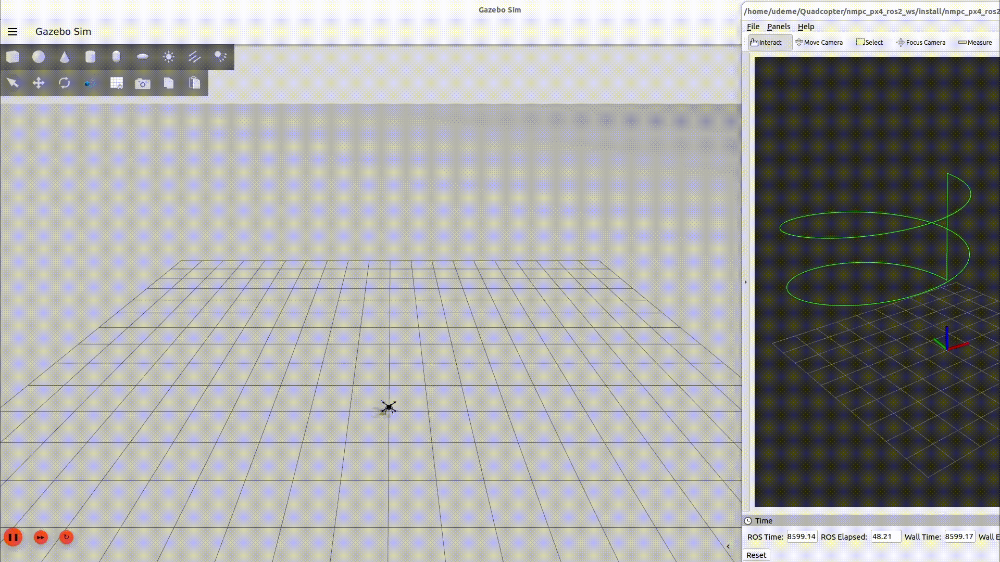
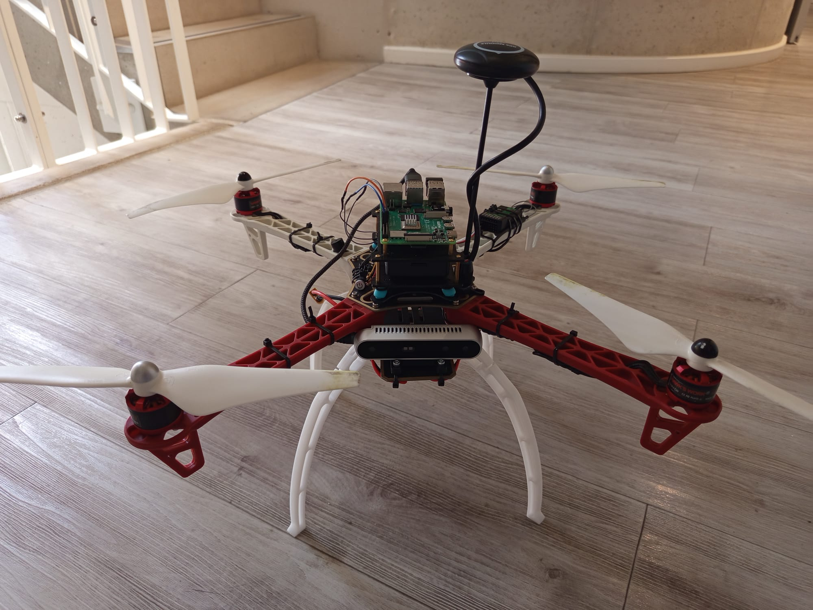
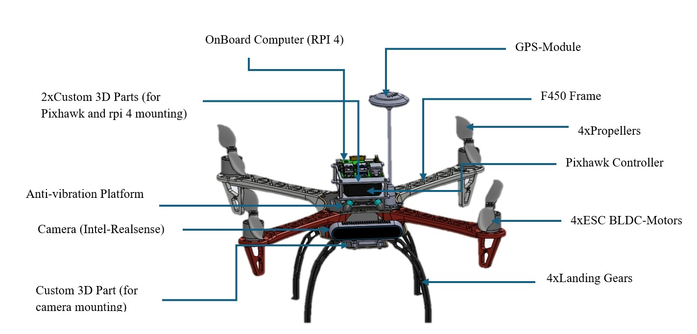

# Autonomous F450 Quadcopter

<div align="center">


**NMPC-based trajectory tracking for autonomous flight**



*Real-time NMPC trajectory tracking in Gazebo with PX4 SITL*

</div>

---

## About This Project

End-to-end autonomous quadcopter development demonstrating the complete robotics pipeline: mathematical modeling → algorithm development → simulation validation → hardware integration.

**Core Achievement**: Implemented real-time Nonlinear Model Predictive Control achieving <1ms solve times and <15cm tracking error in simulation.

---

## Technical Highlights

| Area | Implementation |
|------|----------------|
| **Control** | NMPC with 5 algorithm variants (multiple shooting, feedback linearization, disturbance observer) |
| **Optimization** | Acados C code generation for real-time performance (0.48ms solve time) |
| **Simulation** | Full PX4 SITL integration with custom Gazebo models |
| **Software** | ROS2 Humble, custom flight mode via px4-ros2-interface-lib |
| **Hardware** | Pixhawk + Raspberry Pi 4B with custom 3D-printed mounts |

---

## System Architecture

```
┌─────────────────────────────────────────────────────────────────┐
│                        DEVELOPMENT                              │
├─────────────────────────────────────────────────────────────────┤
│  CasADi (Python)  →  Acados (C code gen)  →  ROS2 Node (C++)   │
│  [Prototyping]        [Optimization]          [Real-time]       │
└─────────────────────────────────────────────────────────────────┘
                              ↓
┌─────────────────────────────────────────────────────────────────┐
│                        VALIDATION                               │
├─────────────────────────────────────────────────────────────────┤
│  PX4 SITL  ←→  ROS2  ←→  NMPC Node  ←→  Gazebo                 │
└─────────────────────────────────────────────────────────────────┘
                              ↓
┌─────────────────────────────────────────────────────────────────┐
│                        DEPLOYMENT                               │
├─────────────────────────────────────────────────────────────────┤
│  Pixhawk  ←→  MAVLink  ←→  Raspberry Pi 4B  ←→  ROS2 Nodes     │
└─────────────────────────────────────────────────────────────────┘
```

---

## Simulation Results

| Metric | Value |
|--------|-------|
| NMPC Solve Time | 0.48 ms |
| Position RMSE | 0.124 m |
| Max Tracking Error | 0.19 m |
| Control Horizon | N = 10 |

*Results from Gazebo SITL simulation with PX4. Hardware flight testing planned.*

<table>
<tr>
<td width="50%">

<p align="center"><sub>F450 Hardware Platform</sub></p>
</td>
<td width="50%">

<p align="center"><sub>Custom 3D-Printed Integration</sub></p>
</td>
</tr>
</table>

---

## Skills Demonstrated

**Control Systems**: Nonlinear dynamics modeling, optimal control formulation, NMPC implementation, feedback linearization, disturbance rejection

**Software Engineering**: ROS2 node development (C++), real-time systems, CMake/colcon build systems, PX4 integration

**Robotics Integration**: Sensor fusion concepts, coordinate frame management (NED/ENU), hardware-software interface design

**Tools**: CasADi, Acados, Gazebo, PX4, MAVROS2, Fusion 360

---

## Repository Structure

```
├── algorithms/nmpc/           # NMPC implementations (Python/CasADi)
│   ├── Acados/                    # 5 real-time variants
│   ├── Multiple_Single_shooting/  # Shooting methods
│   └── Feedback_Linearisation/    # FBL-MPC with DOB
│
├── nmpc_px4_ros2_ws/          # ROS2 workspace
│   └── src/nmpc_px4_ros2/         # NMPC flight mode node (C++)
│
├── model/                     # Custom PX4 Gazebo models
├── src/drone_control/         # Hardware deployment code
└── hardware/cad_models/       # STEP files for 3D printing
```

---

## Quick Start

```bash
# Run NMPC in Gazebo SITL
cd ~/PX4-Autopilot && make px4_sitl gz_quad_f450_camera
MicroXRCEAgent udp4 -p 8888
cd ~/Quadcopter/nmpc_px4_ros2_ws && source install/setup.bash
ros2 launch nmpc_px4_ros2_bringup bringup.launch.py
```

---

## Documentation

Detailed technical documentation in the [Wiki](https://github.com/Desmondfotock28/Quadcopter/wiki):

- [Control Theory](https://github.com/Desmondfotock28/Quadcopter/wiki/Control-Theory) - Mathematical modeling and dynamics
- [NMPC Implementation](https://github.com/Desmondfotock28/Quadcopter/wiki/NMPC-Implementation) - Algorithm details and performance analysis
- [ROS Integration](https://github.com/Desmondfotock28/Quadcopter/wiki/ROS-Integration) - Software architecture and SITL setup

---

## Status

- [x] NMPC algorithm development and validation
- [x] Gazebo SITL simulation with PX4
- [x] Hardware integration (Pixhawk + RPi4B)
- [ ] Intel RealSense integration (in progress)
- [ ] SLAM for GPS-denied navigation (planned)

---

## Contact

**Fotock Desmond** - [fotockd@yahoo.co.uk](mailto:fotockd@yahoo.co.uk)

Open to robotics engineering opportunities. See the [Learning Journey](https://github.com/Desmondfotock28/Quadcopter/wiki/Learning-Journey) for skills developed through this project.

---

<div align="center">

*A portfolio project demonstrating end-to-end autonomous systems development*

</div>
